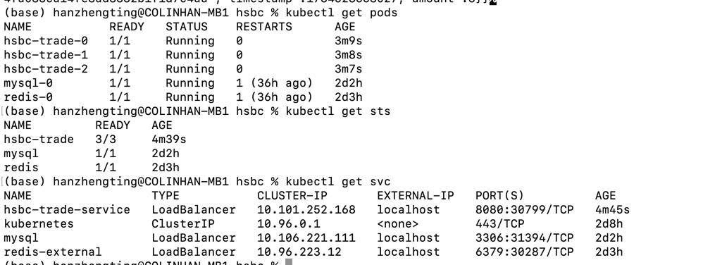
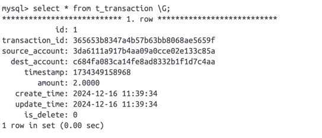
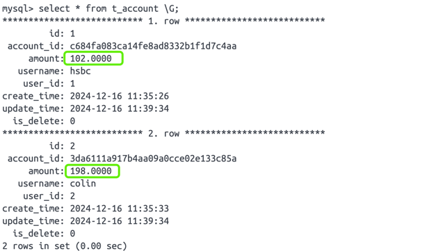

### 搭建私人镜像仓库
```shell
mkdir auth # 创建账户密码
htpasswd -Bc auth/htpasswd colinhan

kubectl create secret docker-registry registry-secret \
  --docker-username=colinhan \
  --docker-password=colinhan \
  --docker-server=127.0.0.1:5001

docker run -d -p 5001:5000 --restart=always --name registry \
  -v /Users/hanzhengting/Opt/k8s/auth:/auth \
  -e "REGISTRY_AUTH=htpasswd" \
  -e "REGISTRY_AUTH_HTPASSWD_REALM=Registry Realm" \
  -e REGISTRY_AUTH_HTPASSWD_PATH=/auth/htpasswd \
  registry

docker login -u colinhan -p colinhan 127.0.0.1:5001
```

### 镜像打包/上传个人仓库
```shell
cd deploy
rm -rf start.jar
cp ../start/target/start.jar ./
docker images 127.0.0.1:5001/hsbc-trade #查看镜像
docker rmi 127.0.0.1:5001/hsbc-trade # 删除镜像
docker build -t hsbc-trade .
docker tag hsbc-trade 127.0.0.1:5001/hsbc-trade
docker push 127.0.0.1:5001/hsbc-trade
```

### 服务部署
```shell
# 工程打jar包
mvn clean package -DskipTests


kubectl apply -f redis-sts.yaml
kubectl apply -f mysql-sts.yaml
kubectl apply -f trade-sts.yaml

```


###  Postman测试
```
# 接口探活
curl '127.0.0.1:8080/health'
#返回
health

# 接口调用
http://127.0.0.1:8080/transaction/process POST
{
    "SourceAccount":"3da6111a917b4aa09a0cce02e133c85a",
    "DestAccount":"c684fa083ca14fe8ad8332b1f1d7c4aa",
    "Amount":2
}
# 返回
{
    "success": true,
    "errCode": null,
    "errMessage": null,
    "requestId": null,
    "data": {
        "id": 0,
        "sourceAccount": "3da6111a917b4aa09a0cce02e133c85a",
        "destAccount": "c684fa083ca14fe8ad8332b1f1d7c4aa",
        "timestamp": 1734349158968,
        "amount": 2
    }
}
```
### 表数据




### 失败重试
```markdown
见方法：
com.hsbc.trade.domain.service.impl.TransactionDomainServiceImpl.modify()
com.hsbc.trade.domain.service.impl.TransactionDomainServiceImpl.process()
交易失败后支持重试3次，依次延迟1s、2s、4s
```


