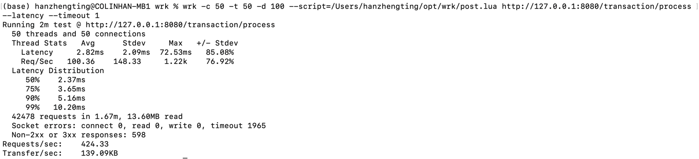

# 说明：
这份压测报告是基于``lua``实现的金融转账业务，详细逻辑见com.hsbc.trade.domain.service.impl.TransactionDomainServiceImpl#process(TransactionEntity entity)
方法

### 1.集群配置
个人mac配置为：内存32G，10C


k8s、docker、mysql、redis及hsbc-trade服务均为本地k8s集群部署，其中hsbc-trade部署了3个pod，mysql、redis均为单pod，详见deploy文件
夹相关sts文件

### 2.转账数量校验
`先设置source账号和dest账户的初始值分别为20000和0，执行wrk命令后`


`wrk压测命令：`
```markdown
wrk -c 20 -t 2 -d 10 --script=/Users/hanzhengting/opt/wrk/post.lua http://127.0.0.1:8080/transaction/process --latency --timeout 1
-c:开启的链接数
-t:开启的线程数
-d:持续时间
```
`post.lua如下：`
```markdown
wrk.method = "POST"

-- 设置请求体为JSON字符串，注意JSON字符串需要正确转义
wrk.body = '{"SourceAccount":"3da6111a917b4aa09a0cce02e133c85a","DestAccount":"c684fa083ca14fe8ad8332b1f1d7c4aa","Amount":1}'

-- 设置Content-Type为application/json
wrk.headers["Content-Type"] = "application/json"

-- 可选：设置响应处理函数
response = function(status, headers, body)
-- 这里可以打印响应体，用于调试
-- print(body)
end
```
`wrk压测结果如下：`


### 3.压测性能
#### 3.1 改变线程数
链接数设置为20不变（-c），将线程数从2增加到20分别进行压测，随着并发度变高，QPS从5400降到了400，耗时变化相对平稳，基本在
10ms内

`(1)线程数=2`


`(2)线程数=5`


`(3)线程=20`

`(4)设置-c=50 -t=50,持续压测100s,共4.2w请求，超时1965，失败598，QPS100，p99为10ms`
