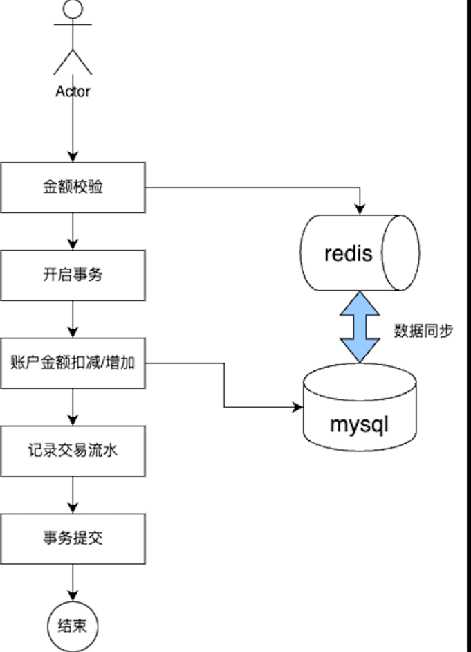
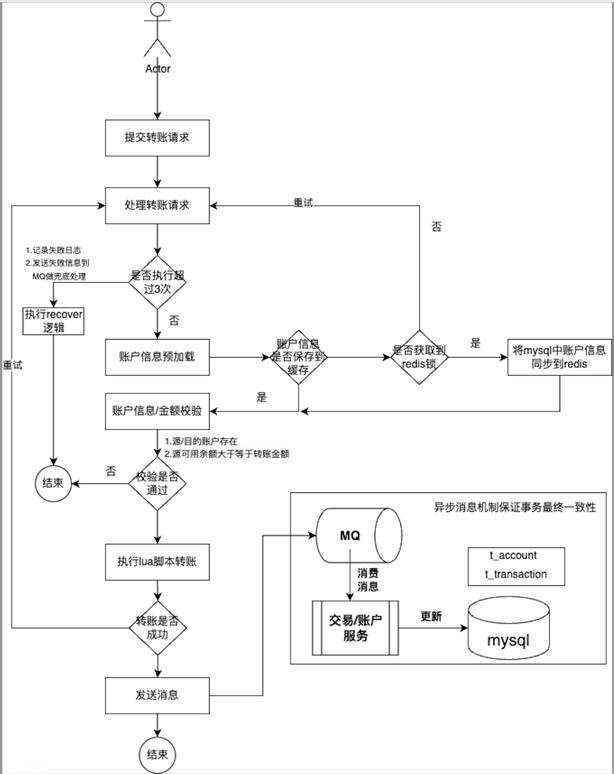
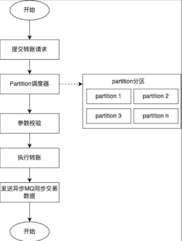

### 1.架构设计

共有2种方案：

#### 方案1：基于mysql+redis实现

```markdown
该把账户信息缓存在redis中，每次库存校验时从redis中获取账户金额等信息，增加接口性能。库存扣减时，再进行mysql和redis的数据同步。

该方案实现参考：com.hsbc.trade.domain.service.impl.TransactionDomainServiceImpl.modify方法。
优点：实现简单；
不足：
(1) 所有请求都需要获取锁后才可以扣减账户金额。当请求量大时，大量请求都会阻塞在db层，甚至导致请求超时，方案性能可参考doc/performance-test模块数据。
(2)可能会数据同步的问题，导致转账金额发生错误。

```




#### 方案2：基于Redis LUA、MQ（kafka or pulsar）实现


实际中选择方案2，架构如下：



```markdown
代码见：com.hsbc.trade.domain.service.impl.TransactionDomainServiceImpl.process

单测见：doc/junit

性能测试见：doc/performance-test

1.该方案包括缓存预加载、失败重试、lua脚本、数据同步等模块
1.1）预加载：
a) 在服务部署时，会初始化部分db中热点账户数据到缓存中
b) 在每一笔转账操作时，当缓存中没有账户数据时，会从db中加载数据到缓存中
1.2) 失败重试
转账交易过程中（执行lua脚本、查询db、更新缓存等）发生异常时，会进行重试，最多3次，依次等待递增间隔时间重试，对账户不存在及源账户可用金额小于转账金额的情况，不进行重试
1.3) lua脚本
通过lua脚本保证A账户向B账户转账操作的原子性，同时在lua脚本中会校验账户是否存在，可用金额是否够
1.4) 数据同步（异步）
转账成功后会发送交易明细MQ消息，有单独的consumer服务将数据同步到db，在提升转账业务的高并发性的同时，使用MQ来保障转账事务的最终一致性。
```

#### 方案3：水平扩展（思考）
```markdown
上面的方案2的redis可能成为性能瓶颈，如果是redis cluster支持水平扩容，如果是主从架构的redis服务，则考虑在业务侧实现水平扩展能力，提升整个转账服务的并发性能。

可以参考es、kafka等组件分片的思路来提升水平扩展的能力。
```


### 2.工程实现

```markdown
项目采用ddd架构，共分为adapter、client、app、domain、infrastructure层，adapter是适配层，主要提供restful api接口、定时任务、或者消费MQ消息的逻辑。
client主要对外提供openapi facade接口，这一层逻辑很薄，jar
dependence依赖也尽可能少，对外提供最清爽的接口定义层。adapter调用client定义的接口，app层实现facade层定义的接口并调用domain领域层的服务，
domain领域层负责组装具体业务逻辑。infrastructure是基础设施层，缓存/数据库/MQ/三方接口相关逻辑均在这一层进行封装，提供业务接口供domain/app层调用，但具体逻辑实现对上层透明。
在app/domain及domain/infra层均有防腐层，对adapter层的出入参及infra层的数据进行转换。
```
