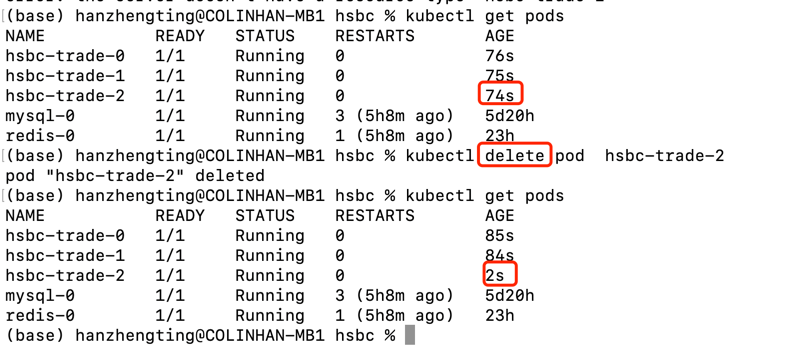

### 1.使用命令delete pod，k8s自动拉起
```markdown
(base) hanzhengting@COLINHAN-MB1 hsbc % kubectl get pods           
NAME           READY   STATUS    RESTARTS       AGE
hsbc-trade-0   1/1     Running   0              76s
hsbc-trade-1   1/1     Running   0              75s
hsbc-trade-2   1/1     Running   0              74s
mysql-0        1/1     Running   3 (5h8m ago)   5d20h
redis-0        1/1     Running   1 (5h8m ago)   23h
(base) hanzhengting@COLINHAN-MB1 hsbc % kubectl delete pod  hsbc-trade-2
pod "hsbc-trade-2" deleted
(base) hanzhengting@COLINHAN-MB1 hsbc % kubectl get pods                
NAME           READY   STATUS    RESTARTS       AGE
hsbc-trade-0   1/1     Running   0              85s
hsbc-trade-1   1/1     Running   0              84s
hsbc-trade-2   1/1     Running   0              2s
mysql-0        1/1     Running   3 (5h8m ago)   5d20h
redis-0        1/1     Running   1 (5h8m ago)   23h
```


### 2.